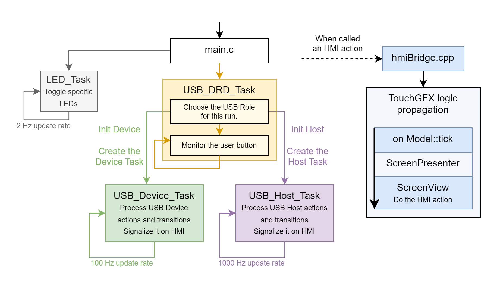

# Dual‑Role USB Host/Device with TouchGFX HMI  
**Course:** Komunikační Rozhraní Počítačů (CTU FEE)  
**Author:** Ondřej Pavlín, KyR (Cybernetics & Robotics), CTU FEE, Prague  
**Platform:** STM32H747I‑DISCO (CM7) with TouchGFX  
**Date:** Winter 2025

---

## 1. Purpose and Scope
This report documents the design and implementation of a dual‑role USB solution (Device + Host) with a TouchGFX user interface on the STM32H747I‑DISCO. It highlights architectural choices, toolchain constraints, and corrective actions taken to achieve reliable role-switching, enumeration and data display.
It focuses on architectural and low-level implementation challenges rather than end-user USB protocol semantics.

## 2. Development Process and Toolchain
- **Base project:** Generated with TouchGFX Designer (UI scaffolding: Screen1/Screen2/Screen3).  
- **CubeMX/STM32CubeIDE:** Initially used to enable USB **Device** via `.ioc` and generate code.  
- **Manual Host integration:** A separate minimal USB **Host** project was generated via `.ioc`and used as a reference for hand-wiring into this dual-role project. The Host stack was copied in (Core, Class, Target/App) and hand‑wired. This required:
  - Manually copying selected folders such as: 
    ```
    /CM7/USB_HOST/App
    /CM7/USB_HOST/Target
    /Middlewares/ST/STM32_USB_Host_Library/Core
    /Middlewares/ST/STM32_USB_Host_Library/Class
    ```
  - Adding Host include/source paths to MCU GCC/G++ compilers.
  - Adding linked resources so STM32CubeIDE sees imported folders.
  - Reconciling HAL/LL init, interrupts, and BSP glue.
- **Important constraint:** Re‑generating code from `.ioc` now breaks the project (hundreds of errors) because CubeMX overwrites manual Host additions and include paths. TouchGFX Designer remains usable and the HMI can be modified and re-generated. Any CubeMX changes must be generated in a throwaway project and ported manually selectively.
- This constraint is a direct consequence of mixing auto-generated TouchGFX scaffolding with manually integrated USB Host middleware, and is a known limitation of current STM32 tooling rather than a design oversight.

- A similar Dual-Role USB project (with a different STM board) is explained in the following **ST article**: https://community.st.com/t5/stm32-mcus/how-to-configure-stm32-as-usb-dual-role/ta-p/805806#toc-hId-1305948. This article directly points out that:
    > It is important to note that if you use the code generation tool again, errors might occur because the code generation deletes added files and resets modified ones.'

## 3. USB Dual-Role Architecture
Although the STM32H747 microcontroller supports USB OTG High-Speed with an external ULPI PHY, the practical implementation of a Dual-Role Device (DRD) differs significantly from the classical USB OTG model described in the USB specification.

In this project, the USB role (Host or Device) is selected explicitly at system startup and remains fixed for the entire runtime session. The role is chosen by application logic and implemented by initializing either the USB Device stack or the USB Host stack, but never both concurrently.

The architecture therefore follows a **mutually exclusive role model**:
- USB Device mode: CDC interface for communication with a PC.
- USB Host mode: enumeration and interaction with external USB devices (AUDIO, CDC, HID, MSC, MTP).

A dedicated `USB_DRD_Task` is responsible for:
- selecting the USB role,
- performing a full USB peripheral reset sequence,
- initializing the corresponding stack,
- starting the role-specific USB task.

This approach avoids concurrent access to the OTG HS peripheral and ensures deterministic behavior. Determinism was prioritized over theoretical OTG feature completeness.


## 4. Detailed High‑Level Architecture

The high-level architecture of the system is described in the following diagram. I will now also provide a detailed overview of the system architecture.

- The **main.c** performs the system initialization and creates `LED_Task`, `USB_DRD_Task` and `TouchGFX_Task`
- The **LED_Task** serves as a simple debugging and signalization feature. It toggles the Green (resp. Yellow) LED when the USB role is Device (resp. Host).
Besides that it also toggles the blue LED in every sittuation. Toggling is executed once every 500 ms.

- The **USB_DRD_Task** stands for ***Dual-Role-Device*** Task and it provides the USB Device and USB Host integration to the single system. It executes the following:
    1) At first it **reads the USB role** value stored in backup registers (and validates it with a magic flag); if the flag is missing it initializes the mode to “Device,” then returns whether the board should boot as USB Host or USB Device so the firmware knows which role to start.
    2) Based on the USB role value, it initializes the corresponding USB role stack and creates the USB role task.
    3) After the USB role is chosen, it goes into an infinite loop and monitors the user blue button. When pressed it writes the oposite USB role value to the backup register, ensures write completed and then resets the whole system. The backup registers survive the reset and next time the system boots into the oposite USB role, effectively **implementing USB role switching**. Keep in mind that to change USB roles, we reset the whole system because Host vs. Device use different OTG/ULPI configurations, stacks, and interrupt routing; tearing one down and bringing the other up “live” risks leaving hardware and ISRs in an undefined state. The shared HS USB interrupt is dispatched through `USBHS_IRQHandler_Func` to the active role’s handler, so a clean reboot guarantees the correct handler and a fresh hardware baseline. Something we couldn’t ensure reliably during a hot switch.

- Both the **USB_Device_Task** and **USB_Host_Task** handles the USB logic in a state machine and signalizes the state on the HMI screen (using the hmiBridge). Both are RTOS threads that poll their respective USB stack and push UI updates, but one makes the board a peripheral to a PC, while the other makes it the bus master for external devices.
The **USB_Device_Task** runs at 100 Hz because the CDC state machine does not need tight polling, while the **USB_Host_Task**  runs much faster (at 1000 Hz) to keep up with enumeration, URB scheduling and SOF-driven host state changes.

- **TouchGFX** runs in its own RTOS thread (TouchGFX_Task) created from main.c; the task immediately enters the generated touchgfx_taskEntry() loop, where the TouchGFX HAL drives the display, handles VSYNC, and dispatches events. The application code never calls the HMI screen views directly. Firmware code uses hmiBridge.cpp C wrappers (e.g., HMI_setUsbRoleText, HMI_addSystemMessage) to pass data into the C++ model. On each frame, the model’s `tick()` propagates pending updates through the presenter to the active view. This separation keeps UI rendering in the TouchGFX thread while allowing the USB tasks to trigger UI changes safely via the bridge.

    


<!-- ## 4. Key Design Decisions and Rationale
- **Hybrid project (TouchGFX + manual Host glue):** Enables DRD without regenerating `.ioc`, at the cost of forbidding automatic codegen.  
- **Alignment discipline:** All buffers touched by OTG HS DMA are 32‑byte aligned; packed structures are written byte‑wise. UNALIGN_TRP remains enabled to surface bugs.  
- **Control‑path safety:** String descriptor reads deferred until control engine idle; avoids deadlocks/hardfaults.  
- **Cold‑start robustness:** NRST alone left OTG/ULPI and devices in undefined states; explicit peripheral reset + VBUS power‑cycle + port reset makes NRST behave like power‑cycle.  
- **Logging:** Host state, enum state, stall details routed to HMI for field diagnosis. -->

## 5. Why Classic USB OTG Role Switching Is Not Used

The USB OTG specification allows dynamic role switching between Host and Device using SRP/HNP negotiation. However, this mechanism is not suitable for practical implementation on the STM32H747 in combination with the ST USB middleware and a complex RTOS-based application.

The main reasons are:

1. **ST USB stacks are not re-entrant and not designed for live role switching**  
   The USB Device and USB Host stacks each assume exclusive ownership of the OTG peripheral, internal buffers, interrupts, and state machines. Switching roles at runtime would require fully deinitializing one stack while the other is active, which is not supported by the middleware and leads to undefined behavior.

2. **OTG HS peripheral and ULPI PHY are not fully reset by NRST**  
   A software reset does not guarantee a clean USB state. The external USB device often remains powered through VBUS, and the ULPI PHY can retain internal state. Without a full power-cycle or forced peripheral reset, enumeration frequently fails.

3. **FreeRTOS and TouchGFX introduce timing and critical-section constraints**  
   USB Host operation depends on timely interrupt handling (SOF, HCINT). Dynamic role switching during runtime risks interrupt starvation, race conditions, and corruption of USB state machines.

4. **VBUS control and power sequencing must be deterministic**  
   Reliable USB Host operation requires explicit control of VBUS and port reset timing. These requirements conflict with dynamic OTG negotiation logic, especially when the application already controls system power and reset behavior.

For these reasons, the project deliberately avoids classical OTG negotiation (not implemented by any ST library) and instead implements a **controlled reboot-style role selection**, where the USB role is chosen at startup and remains fixed until the next reset or power-cycle.

<!-- 
## 6. Issues Encountered and Solutions
| Issue | Root Cause | Fix |
| --- | --- | --- |
| HardFaults during MSC enumeration | Unaligned word writes into packed CBW/Inquiry structures with UNALIGN_TRP set | Align BOT buffers; byte‑wise clear/copy for CBW and inquiry fields |
| Enumeration stalls after warm reset | OTG HS/ULPI and device not truly reset on NRST; device remained in addressed state | Force RCC reset of OTG HS + ULPI; VBUS off/on; mandatory port reset with long delays |
| .ioc regeneration breaks build | CubeMX overwrites manual Host integration and include paths | Treat `.ioc` as read‑only; use throwaway projects to diff and copy specific changes |
| UI device info missing | Model gating updates when Screen1 inactive; some calls to empty listener | Always dispatch `setDeviceInfo` to current listener; store last info and replay on Screen1 activation | -->

## 6. Critical Implementation Challenges

The most challenging aspects of the implementation were not related to basic USB protocol handling, but to low-level system behavior, memory alignment, and reset sequencing.

### 6.1 Alignment and DMA Safety on Cortex-M7
The USB OTG HS peripheral uses DMA and performs word-wide accesses. Many USB data structures defined by the USB specification (descriptors, MSC CBW/CSW) are byte-packed and not naturally aligned.

On Cortex-M7 with UNALIGN_TRP enabled, any unaligned word or half-word access results in a HardFault. Several such faults were encountered during enumeration and MSC BOT initialization.

The solution required:
- enforcing explicit 4-byte alignment for all DMA-visible buffers,
- replacing word-based `memset`/`memcpy` with byte-wise operations for packed structures,
- auditing all descriptor parsing code to avoid implicit wide accesses.

### 6.2 Enumeration Failures After Warm Reset
A recurring issue was that USB Host enumeration succeeded only after a full power-cycle, but consistently failed after pressing the reset button.

Root cause analysis showed that:
- the USB flash drive remained powered via VBUS after NRST,
- the OTG HS peripheral and ULPI PHY were not fully reset,
- the host stack missed critical attach/reset events.

The fix involved:
- forcing an RCC reset of the OTG HS core and ULPI interface,
- explicitly cycling VBUS power (OFF → delay → ON),
- performing a mandatory USB port reset after host initialization.

This ensured that a warm reset is functionally equivalent to a physical re-plug from the USB bus perspective.

### 6.3 Non-Reentrancy of the USB Host Stack
The ST USB Host stack assumes a single execution context. Calling `USBH_Process()` from multiple tasks or injecting manual resets during enumeration led to corrupted state machines and non-deterministic behavior.

The final design enforces:
- exactly one task responsible for USB Host processing,
- no re-entrant calls,
- no forced HCD or port manipulation during active enumeration.


## 7. Validation
- **Host enumeration:** Tested with HID, MSC flash drive. After cold‑start sequence, enumeration is reliable (no stalls/hardfaults).  
- **Warm reset:** Repeated warm resets without power removal no longer cause enumeration failure. Previously stalled; now succeeds due to power‑cycle logic.  
- **HMI:** Screen1 shows role/state/device info; Screen2 logs system messages and USB state graph.

<!-- ## 8. Limitations and Risks
- `.ioc` generator cannot be rerun on this project without manual reconciliation.  
- `USBH_LL_DriverVBUS` still lacks hardware VBUS switch control (GPIO/ULPI EVBUS) in BSP; port may rely on board default wiring.  
- Additional classes/buffers must follow alignment/byte‑wise write rules; regressions will reintroduce faults.  
- If ULPI reset/VBUS timing is shortened, re‑verify warm‑reset behavior. -->

## 8. Limitations and Known Weak Points

- The project relies on a hybrid codebase where USB Host integration is performed manually. Regenerating code from `.ioc` is not possible without breaking the build.
- The implementation avoids classical USB OTG HNP/SRP negotiation and instead relies on startup-time role selection.
- VBUS control is implemented in software and depends on correct board-level wiring and timing.
- Adding new USB Host classes requires careful attention to alignment and buffer ownership rules.


## 9. Future Work
- Implement real VBUS drive in `USBH_LL_DriverVBUS` (GPIO or ULPI EVBUS) and expose a GUI indicator (HPRT or driver state).  
- Document a “no‑regen” warning in the repository root; script to diff CubeMX throwaway outputs vs. curated tree.  
- Add lightweight self‑tests for alignment (static assertions, buffer alignment checks) and control‑path sanity.  
- Optimize cold‑start delays once long‑delay configuration is proven stable.

## 10. Conclusions
The project demonstrates a stable dual‑role USB implementation with a responsive TouchGFX HMI on STM32H747I‑DISCO. Success depended on strict buffer alignment, byte‑wise handling of packed USB structures, deferring control‑path operations, and enforcing a true cold‑start sequence for the OTG HS/ULPI subsystem. The hybrid nature of the codebase (TouchGFX + hand‑integrated Host) requires disciplined maintenance: avoid `.ioc` regeneration, preserve alignment practices, and manage VBUS/reset sequencing explicitly.
